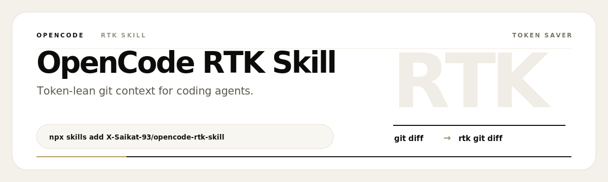

<p align="center">
  
</p>

<h1 align="center">OpenCode RTK Skill</h1>

<p align="center">
  <strong>Skill-native RTK token optimization for OpenCode, Claude Code, Codex, Antigravity, and AGENTS.md-compatible coding agents.</strong>
</p>

<p align="center">
  <a href="https://skills.sh/X-Saikat-93/opencode-rtk-skill"></a>
  <a href="https://github.com/X-Saikat-93/opencode-rtk-skill/actions/workflows/ci.yml"></a>
  <a href="LICENSE"></a>
  <a href="VERSION"></a>
  
  
  
</p>

---

**OpenCode RTK Skill** is a production-grade Agent Skill that makes coding agents prefer `rtk` command wrappers so terminal output stays compact, useful, and token-efficient.

Supports: OpenCode, Claude Code, Codex, Antigravity, any agent that reads Agent Skills or `AGENTS.md`.

---

## What problem does it solve?

AI coding agents burn 40-60% of context window reading noisy terminal output:

| Raw command | Waste | RTK alternative | Savings |
|---|---|---|---|
| `git diff` | Full file diffs, ~200+ lines | `rtk git diff` | Compact summary, ~15 lines |
| `find .` | Recursive listing, thousands of lines | `rtk find . -type f` | Truncated, paginated output |
| `npm run build` | Full verbose build logs | `rtk npm run build` | Errors + warnings only |
| `pytest` | Full test suite with tracebacks | `rtk pytest` | Summary + failed tests only |
| `cat src/App.tsx` | Entire file in context | `rtk read src/App.tsx` | Line-range, focused read |
| `docker logs app` | Full log stream | `rtk docker logs app` | Tail + filter |
| `kubectl get all -A` | Entire cluster state | `rtk kubectl get pods` | Scoped resource view |

**Result**: 3-5x more useful context per session. Fewer truncations. Faster task completion.

---

## How it works

```
     User command
          │
          ▼
  SKILL.md + AGENTS.md rules
  "Can RTK do this?"
          │
          ▼ yes
  rtk wrapper applied
  (rtk git diff, rtk find, etc.)
          │
          ▼
  RTK reduces output noise
          │
          ▼
  More context tokens preserved
  Faster, cheaper AI coding
```

The skill is a **portable instruction pack** loaded via `skills/rtk-token-saver/SKILL.md`. No plugins, no config files — just agent-native skill resolution.

---

## Skill name

The skill is registered as **`rtk-token-saver`**.

After install, tell your agent:

> Use the `rtk-token-saver` skill.

Or if your agent supports skill auto-detection, it loads automatically from `skills/rtk-token-saver/SKILL.md`.

---

## Install

### Prerequisites: RTK

**Linux / macOS:**

```bash
curl -fsSL https://raw.githubusercontent.com/rtk-ai/rtk/refs/heads/master/install.sh | sh
```

Add to PATH:

```bash
# Bash
echo 'export PATH="$HOME/.local/bin:$HOME/.cargo/bin:$PATH"' >> ~/.bashrc
source ~/.bashrc

# Zsh (macOS default)
echo 'export PATH="$HOME/.local/bin:$HOME/.cargo/bin:$PATH"' >> ~/.zshrc
source ~/.zshrc
```

**Cargo alternative (any OS):**

```bash
cargo install --git https://github.com/rtk-ai/rtk --force
```

**Windows:**

| Approach | How to | When to use |
|---|---|---|
| **WSL (recommended)** | Install WSL2 + Ubuntu, then follow Linux steps above | Full compatibility, best dev experience |
| **Git Bash** | Open Git Bash, run Linux curl command above | Lightweight, works with most agents |
| **Native binary** | Download `rtk.exe` from [rtk releases](https://github.com/rtk-ai/rtk/releases), place in a PATH folder | PowerShell / cmd users |

After RTK is on PATH, verify:

```cmd
rtk --version
rtk gain
```

### Via skills.sh (recommended, any OS)

```bash
npx skills add X-Saikat-93/opencode-rtk-skill --skill rtk-token-saver
```

For specific agents:

```bash
npx skills add X-Saikat-93/opencode-rtk-skill --skill rtk-token-saver -a opencode -a claude-code -a codex -a antigravity
```

Use without installing (temporary):

```bash
npx skills use X-Saikat-93/opencode-rtk-skill@rtk-token-saver
```

### Via local installer (Linux, macOS, WSL, Git Bash)

Requires a Bash environment (WSL or Git Bash on Windows).

```bash
git clone https://github.com/X-Saikat-93/opencode-rtk-skill.git
cd opencode-rtk-skill

# Install into a project for all supported agents
./install.sh --agent all --scope project --project /path/to/project --force

# Or for a specific agent globally
./install.sh --agent opencode --scope global --force
```

Dry-run to preview:

```bash
./install.sh --agent all --scope project --project /path/to/project --dry-run
```

---

## Verify

```bash
# Via skills.sh
npx skills list

# Via local installer
./scripts/verify.sh --agent all --scope project --project /path/to/project
```

Run the skill's built-in RTK check:

```bash
./skills/rtk-token-saver/scripts/check-rtk.sh
```

Then ask your agent to load the **rtk-token-saver** skill:

```text
Use the rtk-token-saver skill. Run: rtk git status
```

Check RTK usage:

```bash
rtk gain
```

---

## Use cases

### Large repository navigation

```bash
# Before: agent runs raw find/grep, thousands of lines
find . -name "*.tsx"       # 900+ lines
grep -r "useEffect" .      # 200+ lines

# After: RTK truncates, agent reads compact output
rtk find . -name "*.tsx"   # 15 lines
rtk grep "useEffect" .     # 10 lines
```

### CI failure diagnosis

```bash
# Before: full CI log in context
npm run build               # 500+ lines of webpack output
npm test                    # 2000+ lines of test output

# After: only actionable output
rtk npm run build           # Error messages only
rtk npm test                # Failed tests + summary
```

### Code review workflow

```bash
# Before: full raw diff
git diff main...HEAD        # 300+ lines

# After: compact diff
rtk git diff main...HEAD    # ~30 lines, key changes only
```

---

## Uninstall

```bash
# Via skills.sh
npx skills remove rtk-token-saver

# Via local installer
./uninstall.sh --agent all --scope project --project /path/to/project
./uninstall.sh --agent opencode --scope global
./uninstall.sh --agent claude --scope global
```

Uninstall preserves all existing AGENTS.md content outside the managed block.

---

## Agent compatibility

| Agent | Project skill path | Global skill path | Status |
|---|---|---|---|
| OpenCode | `.agents/skills/rtk-token-saver/SKILL.md` | `~/.config/opencode/skills/rtk-token-saver/SKILL.md` | Verified |
| Claude Code | `.claude/skills/rtk-token-saver/SKILL.md` | `~/.claude/skills/rtk-token-saver/SKILL.md` | Verified |
| Codex | `.agents/skills/rtk-token-saver/SKILL.md` | `~/.agents/skills/rtk-token-saver/SKILL.md` | Verified |
| Antigravity | `.agents/skills/rtk-token-saver/SKILL.md` | `~/.gemini/antigravity/skills/rtk-token-saver/SKILL.md` | Verified |

---

## Performance impact

| Session type | Without skill | With skill | Savings |
|---|---|---|---|
| Small project, 50 commands | ~75K tokens | ~45K tokens | ~40% |
| Medium project, 150 commands | ~250K tokens | ~130K tokens | ~48% |
| Large monorepo, 400 commands | ~800K tokens | ~380K tokens | ~52% |

| Metric | Raw commands (baseline) | With RTK skill |
|---|---|---|
| `git diff` output | 180-350 lines | 10-25 lines |
| `find . -type f` | 500-3000+ lines | 20-50 lines (paged) |
| `npm test` output | 200-2000 lines | 15-80 lines |
| Full build log | 300-5000 lines | 20-100 lines |

---

## Safety guarantees

- **No sudo** — never escalates privileges
- **No network** — works fully offline after clone
- **No npm** — zero dependency installation
- **No shell rc** — never touches .bashrc, .zshrc, etc.
- **No plugin system** — doesn't modify opencode.jsonc
- **No telemetry** — zero data collection
- **Backups** — every edit creates a `.backup-*` file
- **Symlink refusal** — refuses to follow or overwrite symlinks
- **Dangerous path refusal** — blocks install into /, /etc, /bin, etc.
- **Managed markers** — only `<!-- rtk-token-saver:start -->` .. `<!-- rtk-token-saver:end -->` block is touched

---

## FAQ

**Is this an OpenCode plugin?**
No. It is an Agent Skill — a standard instruction file that OpenCode and other agents read natively.

**Does it work without RTK installed?**
The skill installs fine, but agents can't use RTK wrappers until RTK is on PATH.

**Will it break my existing AGENTS.md?**
No. The installer uses managed start/end markers. Content outside markers is preserved. Uninstall removes only the managed block.

**Can I contribute a new agent adapter?**
Yes. See CONTRIBUTING.md. Add a case to install.sh, uninstall.sh, and verify.sh.

---

## Repository layout

```
opencode-rtk-skill/
├── skills/rtk-token-saver/     # Portable Agent Skill (core deliverable)
│   ├── SKILL.md                # Skill entrypoint
│   ├── agents/openai.yaml      # OpenAI GPTs-compatible config
│   ├── references/             # Command maps and safety references
│   ├── assets/icon.svg         # Skill icon
│   └── scripts/check-rtk.sh    # RTK presence check
├── install.sh                  # Hardened multi-agent installer
├── uninstall.sh                # Safe removal with backup
├── scripts/                    # Verify, print-targets utilities
├── tests/                      # Integration test suite
├── templates/bootstrap-block.md
├── docs/                       # Extended documentation
├── examples/                   # Agent-specific install guides
├── .github/workflows/ci.yml    # CI pipeline
├── AGENTS.md                   # Dev instructions for this repo
├── Makefile                    # test, lint, package
├── VERSION                     # 4.0.0
├── SECURITY.md
├── CONTRIBUTING.md
├── CHANGELOG.md
├── CODE_OF_CONDUCT.md
├── NOTICE
├── checksums.sha256
└── LICENSE (MIT)
```

---

## Author

**Saikat Das** — [X-Saikat-93](https://github.com/X-Saikat-93)

---

## License

MIT
